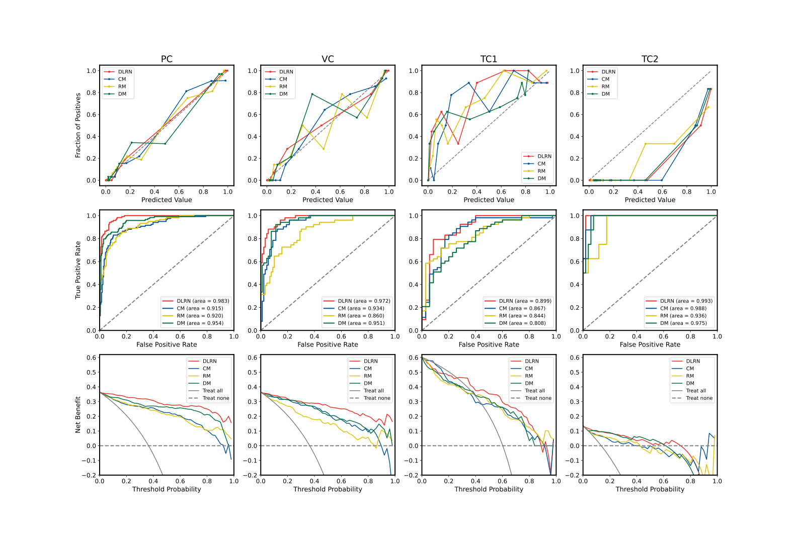
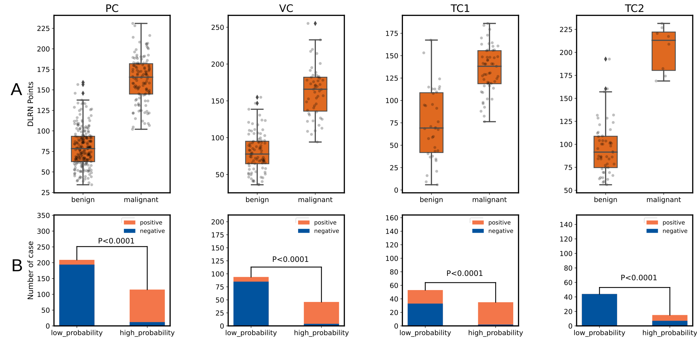
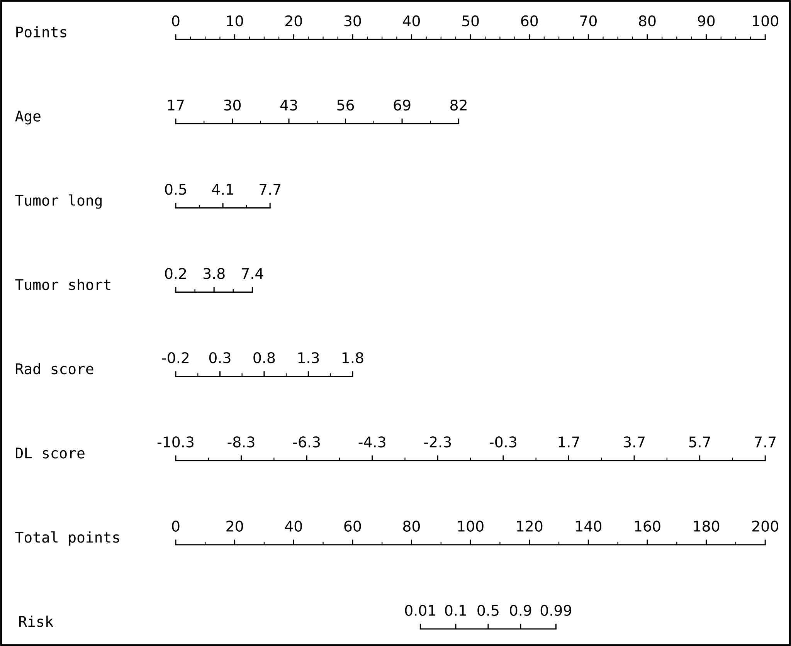

# Multimodality Deep Learning Radiomics Nomogram for Preoperative Prediction of Malignancy of Breast Cancer: A Multicenter Study

by Peiyan Wu, Yan Jiang, Hanshuo Xing, Wenbo Song, Xin-wu Cui, Xinglong Wu and Guoping Xu. This is a code repo of the paper. 

__Methods__: The clinical and ultrasound imaging data, including brightness mode (B-mode) and color Doppler flow imaging (CDFI), of 611 breast cancer patients from multiple hospitals in China were retrospectively analyzed. Patients were divided into one primary cohort (PC), one validation cohort (VC) and two test cohorts (TC1 and TC2). A multimodality deep learning radiomics nomogram (DLRN) was constructed for predicting the MBC. The performance of the proposed DLRN was comprehensively assessed and compared with three unimodal models via the calibration curve, the area under the curve (AUC) of receiver operating characteristics (ROC) and the decision curve analysis (DCA).

## __Results__
__Calibration ROC DCA__


__nomogram points and confusion matrix__


__nomogram__


## __Installation__
Ubuntu 18.04   
__Conda Environment Setup__  
Create your own conda environment
```shell
conda create -n MDLRN python=3.8
conda activate MDLRN
```

Install Pytorch == 2.0.0(depends on your NVIDIA driver and you can see your compatible CUDA version at the right hand corner in nvidia-smi)
```shell
conda install pytorch torchvision torchaudio pytorch-cuda=11.8 -c pytorch -c nvidia
```
Install monai == 1.1.0
```shell
pip install monai[all]
```
other python required packages 
```
pip install -r requirements.txt
```
Install R 4.3.0 and r packages in R_requirements.txt

__Input Folder Format__

```
├── MDLRN
│   ├── code
│   │   ├── deeplearning
│   │   ├── form
│   │   │   ├── clinical
│   │   │   │   ├── pc.csv
│   │   │   │   ├── vc.csv
│   │   │   │   ├── tc1.csv
│   │   │   │   ├── tc2.csv
│   │   │   ├── data_split
│   │   │   │   ├── pc.csv
│   │   │   │   ├── vc.csv
│   │   │   │   ├── tc1.csv
│   │   │   │   ├── tc2.csv
│   │   │   ├── ...
│   │   ├── config.yaml
│   │   ├── MDLRN.ipynb
│   │   ├── nomogram.ipynb
│   ├── data
│   │   ├── origin
│   │   │   ├── PC
│   │   │   │   ├── bus
│   │   │   │   ├── ├── ne_xxxxxx.png(ne means negative)
│   │   │   │   ├── ├── po_xxxxxx.png(po means positive)
│   │   │   │   ├── ├── ...
│   │   │   │   ├── cdfi
│   │   │   │   ├── roi
│   │   │   ├── VC
│   │   │   ├── TC1

```